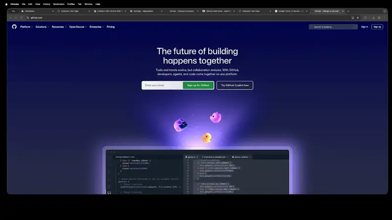

# Back to Top - Chrome Extension

A simple, lightweight Chrome extension that adds a "Back to Top" button to the bottom center of every webpage.

## Features
- **Overlay Button:** A chevron up button appears at the bottom center of the page.
- **Smart Visibility:** The button appears only after scrolling down.
- **Smooth Scrolling:** Clicking the button smoothly scrolls the page back to the top.
- **Non-Intrusive:** Designed to overlay content without blocking vital information.

## Installation

### Load Unpacked (Developer Mode)
1. Clone or download this repository.
2. Open Chrome and navigate to `chrome://extensions`.
3. Enable **Developer mode** in the top right corner.
4. Click **Load unpacked**.
5. Select the directory containing `manifest.json`.

## Usage
1. Visit any webpage with long content (e.g., GitHub logs, documentation).
2. Scroll down until the "Back to Top" button appears at the bottom of the screen.
3. Click the button to return to the top of the page.

## Demo

## Roadmap

### Planned Features
- [ ] **Position Settings:** Option to move the button to Left, Right, or Center.
- [ ] **Smart Detection:** Prevent rendering if the site already has a native "Back to Top" button.
- [ ] **Theming:** Customize icon color, size, and style.
- [ ] **Keyboard Shortcuts:** Trigger scroll-to-top via hotkeys (e.g., `Alt+Up`).
- [ ] **Exclusion List:** Disable the extension on specific domains.
- [ ] **Scroll Progress:** Optional circular indicator showing page read progress.

## License
MIT
